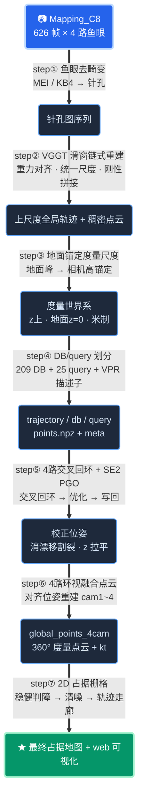
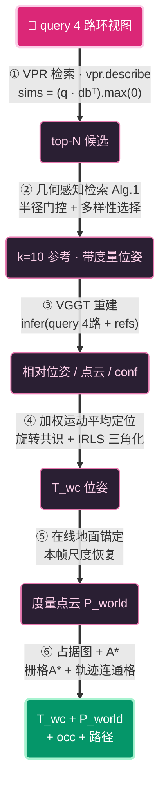
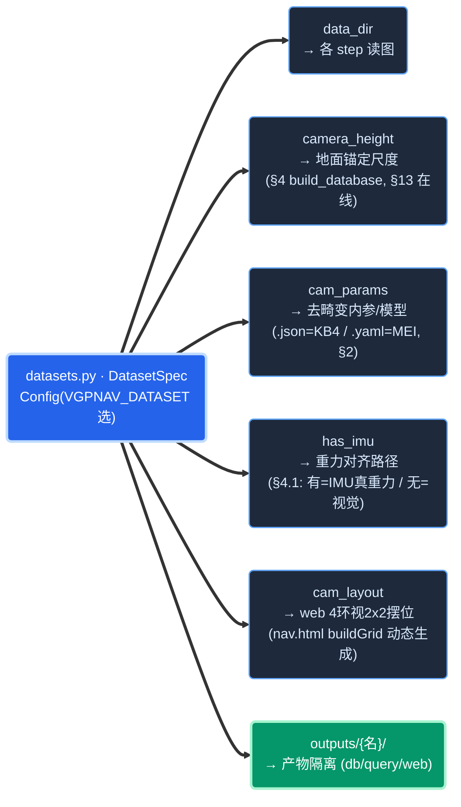
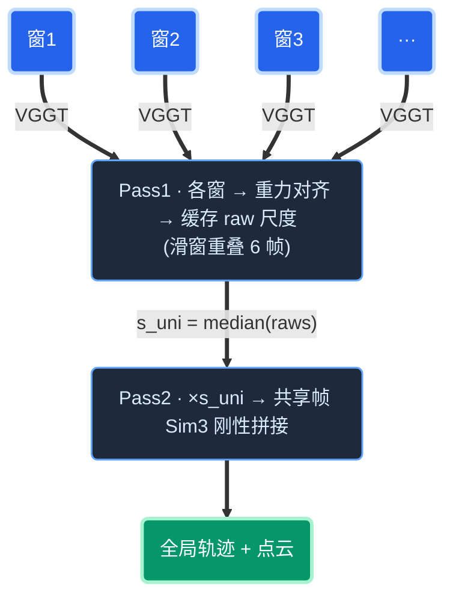
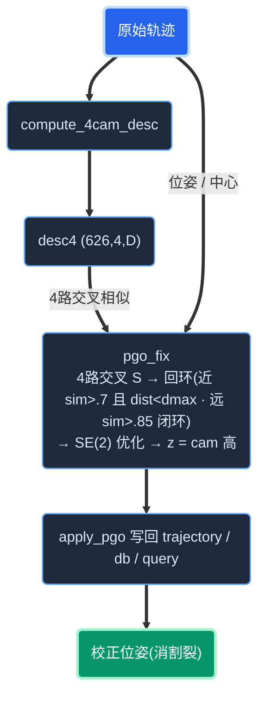
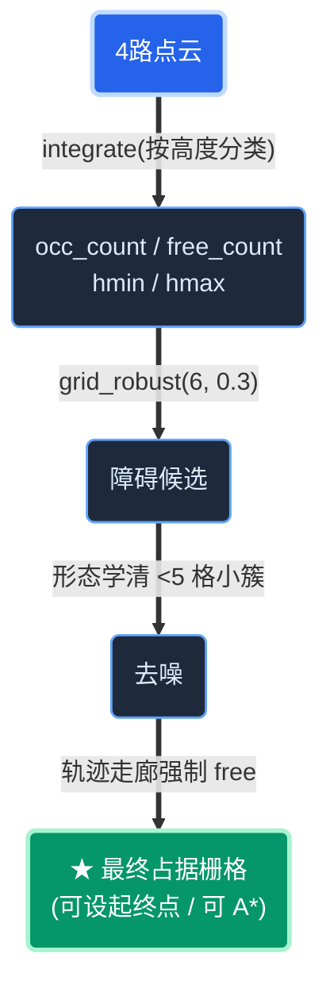
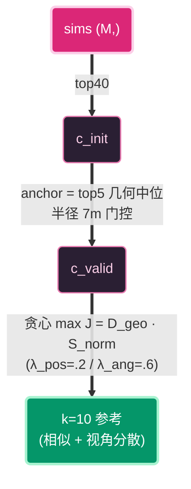
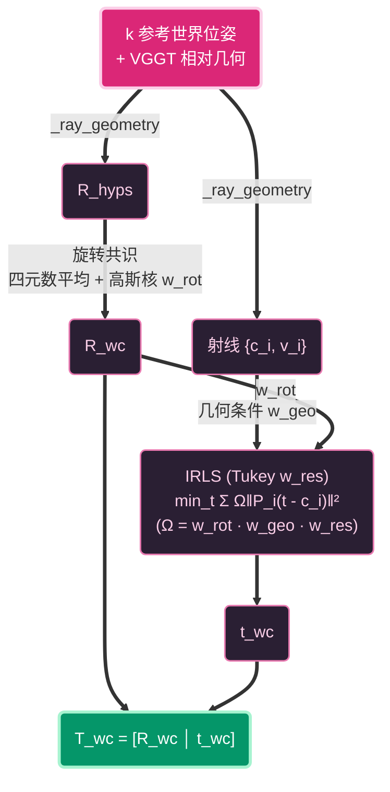
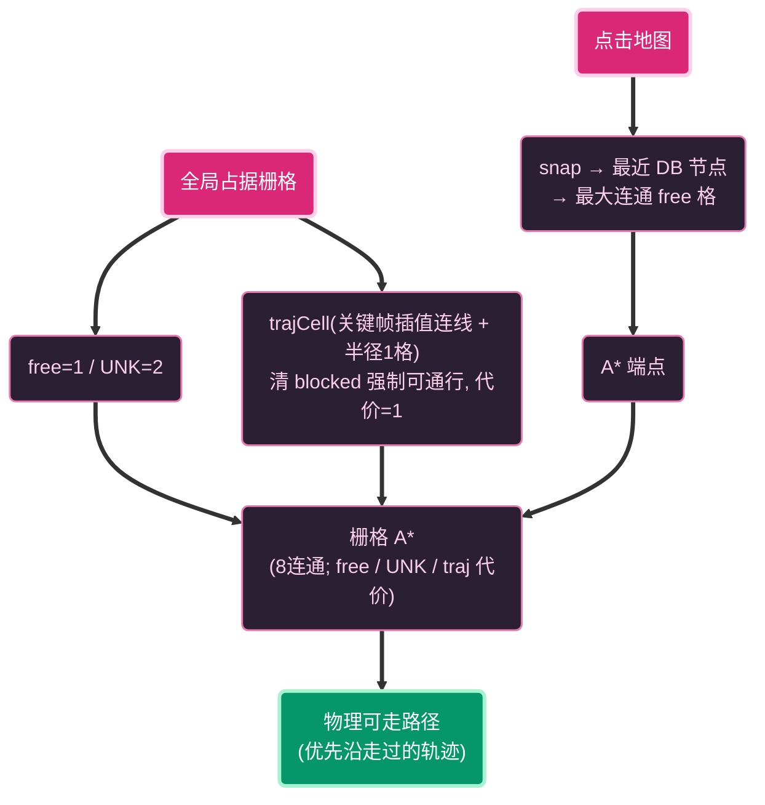
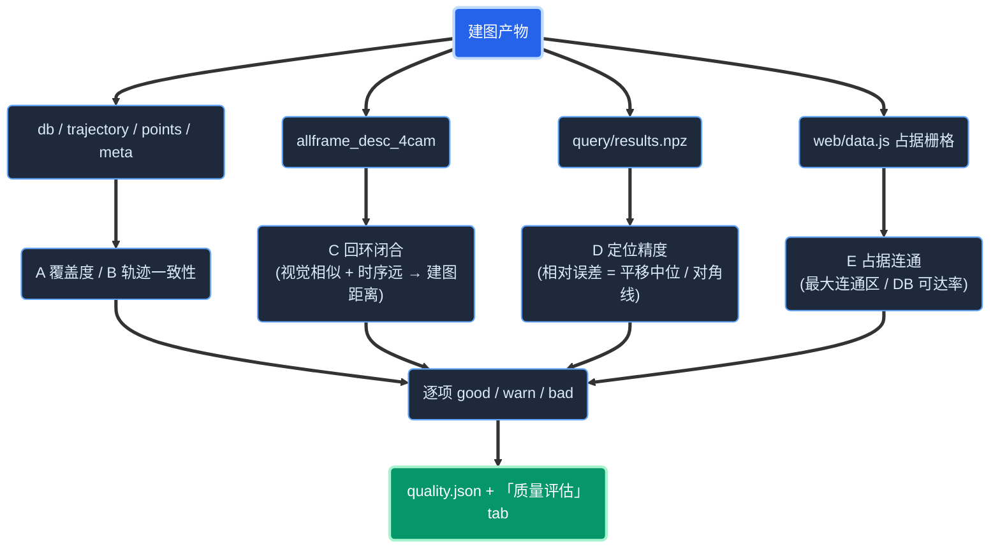

# VGP-Nav 建图与导航 —— 详细过程文档

> 复现论文 **VGP-Nav: Metric-Aware Visual Geometric Perception for Robot Navigation**
> (Pan et al., arXiv 2606.09268)。纯单目 RGB,同时做**度量定位**与**度量障碍感知**,
> 核心是用**地平面几何**把单目重建锚定到真实物理尺度。
>
> 本文档把"从原始数据到可导航地图、再到在线定位导航"的**每一个核心方法细化到逐步实现流程并配流程图**;
> 配套逐条命令见 [`02_代码执行指南.md`](./02_代码执行指南.md)。
>
> 记号约定:`(a,b,c)` 表示数组形状;代码引用形如 `模块.函数`。

---

## 目录
- [0. 顶层流程总览](#0-顶层流程总览)
- [1. 数据与坐标系约定](#1-数据与坐标系约定)
- [2. 建图 step① 鱼眼去畸变](#2-建图-step-鱼眼去畸变-vgpnavundistortpy)
- [3. 建图 step② VGGT 滑窗链式重建](#3-建图-step-vggt-滑窗链式重建-database_chain_trajectory)
- [4. 建图 step③ 地面锚定度量尺度](#4-建图-step-地面锚定度量尺度-scale_recovery--database)
- [5. 建图 step④ DB/query 划分 + 描述子](#5-建图-step-dbquery-划分--描述子)
- [6. 建图 step⑤ 4路交叉回环 + SE(2) PGO](#6-建图-step-4路交叉回环--se2-pgo)
- [7. 建图 step⑥ 4路环视融合点云](#7-建图-step-4路环视融合点云-build_4cam_pointspy)
- [8. 建图 step⑦ 2D 占据栅格(最终地图)](#8-建图-step-2d-占据栅格最终地图)
- [9. 导航 step① VPR 检索](#9-导航-step-vpr-检索)
- [10. 导航 step② 几何感知检索 Algorithm 1](#10-导航-step-几何感知检索-algorithm-1-retrievalpy)
- [11. 导航 step③ VGGT 重建](#11-导航-step-vggt-重建)
- [12. 导航 step④ 加权运动平均定位](#12-导航-step-加权运动平均定位-motion_averagingpy)
- [13. 导航 step⑤ 在线地面锚定尺度恢复](#13-导航-step-在线地面锚定尺度恢复)
- [14. 导航 step⑥ 占据图 + A\*](#14-导航-step-占据图--a-planner)
- [15. 建图质量评估](#15-建图质量评估-scriptsassess_qualitypy)
- [16. 设计要点与已知限制](#16-设计要点与已知限制)
- [17. 数学公式与符号速查](#17-数学公式与符号速查)
- [18. 模块↔论文对应](#18-模块论文对应)

---

## 0. 顶层流程总览

**离线建图**(一次性, `scripts/`):



**在线导航**(每帧, `pipeline.VGPNav.run`):



**与论文差异**:VPR 用 SelaVPR++/DINOv2(非 NetVLAD);无真值,用 VGGT + 地面锚定(相机高)自建伪位姿库;额外增加 **4路环视回环 PGO**(本复现新增,§6)。

---

## 1. 数据与坐标系约定

**原始数据**:DEEPROUTE 办公室一层,626 帧 × 4 路鱼眼 = 2504 张 `{timestamp}_camera_{1..4}.jpg`,**无真值位姿**。

**4 鱼眼物理布局**(相对车体):`cam1`=前左、`cam2`=前右、`cam3`=后右、`cam4`=后左。定位主锚是 **cam1**(单目);cam2/3/4 补 360° 检索/几何/感知。

**坐标系**:

| 记号 | 含义 |
|---|---|
| 相机系 | OpenCV:x 右、y 下、z 前 |
| `extri` (3×4) | VGGT 输出 `[R\|t]`,`world_v → cam`(X_cam = R·X_v + t) |
| `world_v` | VGGT 自定义系(首帧为单位阵),**尺度自由** |
| `T_cw` (4×4) | world→cam;`T_wc=inv(T_cw)` cam→world |
| 相机中心 | `C = -Rᵀt`(`geom.cam_center`) |
| 世界系 | 重力对齐(z 上)、地面 z=0、米制、x-y 原点在首帧 |

### 1.4 多数据集兼容(扩展数据集)

VGP-Nav 支持多数据集共用同一套流程,**加新数据集只需在 `vgpnav/datasets.py` 增加一条 `DatasetSpec`**(name/data_dir/camera_height_m/cam_layout/cam_params/有无IMU),核心算法与脚本零改动。`Config(dataset=...)`(默认读环境变量 `VGPNAV_DATASET`)选择,产物隔离到 `outputs/{数据集}/`。

不同数据集的**差异仅在数据集相关参数**(算法流程不变):

| 维度 | Mapping_C8 | ChuangfuTower_floor1 | ChuangfuTower_floor28 |
|---|---|---|---|
| 显示名 | 深港国际C8 | 创富大厦1楼 | 创富大厦28楼 |
| 场景 | DEEPROUTE 办公一层(室内) | 梅林街区(室外) | 写字楼办公区(室内) |
| 相机模型(→§2) | MEI 鱼眼 `memory-nav/cam/params.yaml` | KB4 鱼眼 `camera_param.json` | KB4 鱼眼 `camera_param.json` |
| 帧数 / map_stride | 626 / 1 | 3215 / 5(≈643帧) | 180 / 1 |
| 相机离地高度(→§4/§13) | 1.3m(机器人) | 1.67m(头盔) | 1.67m(头盔) |
| IMU(→§4.1 重力对齐) | 无,视觉重力对齐 | 有 | 有 |
| 4环视 cam1/2/3/4(→web 摆位) | 前左/前右/后右/后左 | 左后/左前/右前/右后 | 左后/左前/右前/右后 |
| IMU 步频尺度校正(→§4.5) | 不需要 | 需要(室外水平尺度偏小) | 不需要 |



> 本文档其余各步以 **C8 为例**(626帧、1.3m、cam1前左);换数据集时上表的量随之改变,**算法完全一致**。短序列(如 floor28 仅180帧)VGGT 滑窗尺度漂移大、常无回环可修(PGO 只能 z 拉平),建图质量受限。
>
> 当前已注册数据集:`Mapping_C8`(深港国际C8)、`ChuangfuTower_floor1`(创富大厦1楼)、`ChuangfuTower_floor28`(创富大厦28楼)。多个数据集的导航页可用 `scripts/gen_portal.py` 合并成**一个总入口** `outputs/index.html`(顶部按钮切换地图,iframe 嵌各数据集 `nav.html`)。加新数据集的完整操作见 [`02_代码执行指南.md`](./02_代码执行指南.md) §1.5。

---

## 2. 建图 step① 鱼眼去畸变 (`vgpnav/undistort.py`)

**目的**:VGGT 假设输入是针孔图,需把鱼眼重采样为针孔。支持两种相机模型(`load_camera_params` 按文件后缀自动识别):

- **KB4(Kannala-Brandt)鱼眼**(`.json`,如创富大厦):内参 `efl_x,efl_y,cod_x,cod_y` + 畸变 `k1..k4`;去畸变用 `cv2.fisheye.initUndistortRectifyMap`(针孔像素→KB4投影→鱼眼源→remap)。
- **MEI 全向**(`.yaml`,如 C8):内参 `[xi,fx,fy,cx,cy]` + 畸变 `[k1,k2,p1,p2]`;手写 `_project_mei` 逆映射(§2.1/2.2)。

**输出**:两种模型都输出针孔图 `(480,640,3)` + 针孔内参 `K` 供 VGGT。以下 §2.1/2.2 详述 MEI 手写实现;KB4 为等价过程(由 cv2.fisheye 完成)。

### 2.1 MEI 投影 `_project_mei(X)`:3D 相机点 → 鱼眼像素(逐式对齐 C++ 原实现)
```
输入 X:(...,3) 相机系方向
① 单位化:        xs = X / ‖X‖
② 球面投影:      xu = xs.x/(xs.z+xi),  yu = xs.y/(xs.z+xi)      # xi=MEI球面参数
③ 径向畸变因子:  r²=xu²+yu²;  radial = 1 + k1·r² + k2·r⁴
④ 切向+径向:     xd = xu·radial + 2p1·xu·yu + p2(r²+2xu²)
                 yd = yu·radial + p1(r²+2yu²) + 2p2·xu·yu
⑤ 鱼眼像素:      u = fx·xd + cx,  v = fy·yd + cy
返回 (u,v)
```

### 2.2 逆映射表 `_build_maps()`(为每个目标针孔像素反查鱼眼来源)
```
虚拟针孔内参:  f_v = (W/2)/tan(hfov/2),  主点=(W/2,H/2)        # hfov=110°
① 生成针孔像素网格 (gx,gy) = 像素坐标 - 主点
② 针孔射线 (直线, 无柱面):  dirs = [gx, gy, f_v]            # (H,W,3)
③ 可选俯仰:  dirs = dirs @ Rx(pitch_down)ᵀ                  # 正pitch多看地面
④ 投影:  (map_x,map_y) = _project_mei(dirs)                 # 每个针孔像素→鱼眼来源坐标
存 map_x/map_y (float32)
```

### 2.3 重采样 `undistort(img)`
`cv2.remap(img, map_x, map_y, INTER_LINEAR)` 双线性重采样。


---

## 3. 建图 step② VGGT 滑窗链式重建 (`database._chain_trajectory`)

**问题**:单目 VGGT 每个滑窗**尺度独立模糊**;若各窗用自己估的地面尺度,噪声会把地图撑爆/扭曲。**对策:两遍** —— Pass1 缓存逐窗原始尺度,取中位作统一尺度;Pass2 应用统一尺度 + 刚性拼接。

**滑窗参数**:`chunk_size=10`、`chunk_overlap=6` ⇒ 步长 `step=4`。

### 3.1 Pass 1:逐窗 VGGT + 重力对齐 + 原始尺度(VGGT 只跑一遍并缓存)
```
for 每个窗口 st in range(0, N, step):
  local = traj_idx[st : st+10]                     # 窗内帧索引
  ① out = vggt.infer([undistort(frame_i) for i in local])
       → out.extri[k]:(3,4) world_v→cam;  out.world_points[k]:(H,W,3);  out.depth_conf[k]
  ② 逐帧位姿/点云:  T[i]=extri_to_Tcw(extri);  pts[i]=_subsample_points(world_points,conf, n=1500)
                                                  # conf≥50分位过滤 + 随机下采样到1500
  ③ 逐窗重力对齐:
       g_down = estimate_gravity_down([T[i].R for i in local])   # mean(R_wc·[0,1,0])
       Rg     = rotation_align(g_down, [0,0,-1])                 # Rodrigues
       对窗内每帧:  T[i].R←Rg·T[i].R;  T[i].t←Rg·T[i].t;  pts[i]←pts[i]·Rgᵀ
  ④ 逐窗原始尺度(缓存, 不立即用):
       centers=[T[i].t for i in local];  points=vstack(pts)
       raw = anchor_map(centers, points, camera_height)["scale"] # 地面峰+相机高→尺度
  wins.append({local, T, pts, raw})
```

### 3.2 统一稳健尺度
```
s_uni = median([w.raw for w in wins])    # 各窗原始尺度的中位数(消异常窗)
```
> 依据:VGGT 各窗原生尺度近似一致,逐窗地面估计噪声大(杂乱区误判地面→虚高),中位数平滑消噪、保窗间一致;绝对尺度留给末尾全局锚定。

### 3.3 Pass 2:应用统一尺度 + 刚性拼接(Sim3,fix_scale)
```
global_T = {};  pts_global = []
for w in wins:                                         # 按时间顺序
  ① 缩放:  T[i].t *= s_uni;  pts[i] *= s_uni            # 只缩平移/点, 旋转不变
  ② 与已放置全局帧的共享帧做刚性对齐:
       shared = [i for i in w.local if i in global_T]
       if len(shared) ≥ 2:
         _, R, t = align_sim3_from_poses([T[i] for i in shared],
                                          [global_T[i] for i in shared], fix_scale=True)
       else:  R,t = I,0                                  # 首窗
  ③ 把当前窗刚性搬到全局:
       for i in w.local (未放置过):
         Ti.R←R·Ti.R;  Ti.t←R·Ti.t+t;  global_T[i]=Ti
         pts_global.append(pts[i]·Rᵀ + t)
返回 (global_T, vstack(pts_global))
```

**`align_sim3_from_poses`(geom)**:对相机中心近共线(机器人直行)比 Umeyama 更稳——
```
① R = quat_average([R_dst_i · R_src_iᵀ])      # 由姿态求旋转(非点云SVD)
② s = 1 (fix_scale)  或  median(中心两两距离比)
③ t = mean(C_dst - s·R·C_src)                  # 残差平均
```



---

## 4. 建图 step③ 地面锚定度量尺度 (`scale_recovery` + `database`)

把"上尺度"轨迹变成"米制、重力对齐、地面 z=0"。

### 4.1 重力对齐(IMU 真重力 / 视觉回退,`vgpnav/imu.py`)

地面锚定的前提是世界系 z 轴对齐真实重力。按数据集是否有 IMU 自动选两条路径,都输出 world 系**重力 down 方向**:

- **有 IMU(创富 floor1/floor28)**:用加速度计测到的真实重力 + VGGT 位姿,**自标定**相机↔IMU 的固定旋转 `R_cam←imu`(安装姿态未知)。用 Wahba 问题**迭代**联合求解,交替更新:
  - `g_world = normalize(mean_k  R_wc[k] · R_ci · g_imu[k])`   # 各帧 IMU 重力经位姿转 world 后取平均
  - `R_ci`(=R_cam←imu)由 Wahba/SVD 闭式解
  - 收敛后取 `g_world` 为重力 down 方向
- **无 IMU(C8)**:回退视觉 `estimate_gravity_down`——取相机平均朝向 `mean(R_wc·[0,1,0])` 近似重力。

> IMU 真重力比视觉估计稳:头盔采集时头部俯仰/转动会扰动"相机平均朝向",而加速度计直接观测重力。`build_database` 据此 down 方向做全局重力对齐(§4.4 step①)。

### 4.2 找地面高度 `find_ground_peak(z)`
```
输入 z:(N,) 重力对齐后点的高度
① 清理:去 NaN/Inf;取 [1,99] 百分位裁剪极值
② 直方图:hist,edges = histogram(z, bins=160)
③ 只在下半部分找峰:  mask = centers ≤ lo + 0.6·(hi-lo)         # low_frac=0.6
④ ground_z = centers[argmax(hist·mask)]                       # 下半主峰=地面
```
> 直觉:多数点贴地或低于相机,地面是"下半部分最主导的高度峰"。

### 4.3 一次性锚定 `anchor_map(centers, points, camera_height)`
```
① ground_z = find_ground_peak(points.z)
② cam_z    = median(centers.z)
③ height_arb = cam_z - ground_z                  # 上尺度的相机离地高
④ scale    = camera_height / height_arb          # 用真实相机高(C8=1.3m, 创富=1.67m)定尺度
⑤ z_shift  = -ground_z · scale                   # 把地面移到 z=0
返回 {scale, z_shift, ground_z, height_arb}
```

### 4.4 在 `build_database` 中应用(全局)
```
① 全局重力对齐:  down = §4.1 得到的重力方向;  R_align=rotation_align(down, [0,0,-1]);  poses,pts ← 旋转
② anc = anchor_map(poses.centers, pts, camera_height)
   · 物理约束:若 scale<0(重力 down 被标反、地面峰落到相机上方)→ 翻转 down 方向重新对齐并重算,
     保证相机在地面上方、scale>0
③ poses.t = poses.t·scale;  poses.z += z_shift;  pts = pts·scale + [0,0,z_shift]
④ x-y 原点平移到首帧:  poses.xy -= poses[0].xy;  pts.xy -= poses[0].xy
⑤ 自检打印:锚定后相机高度中位应 ≈ camera_height
```

### 4.5 IMU 步频 PDR 尺度校正(室外大场景,`scripts/imu_scale.py` + `scripts/apply_scale.py`)

VGGT 单目对**室外大场景**的水平运动尺度系统性偏小(远景视差小,平移被低估);地面锚定只校正垂直方向(相机高),水平 xy 仍偏小。用 IMU 步频 PDR(行人航位推算)估真实水平路程做全局校正:

**`imu_scale.py`(估全局尺度因子 k)**:
```
① 连续行走几乎无静止段, ZUPT(零速更新)不适用 → 改用步频
② 比力模长 |lin|(不依赖姿态)带通滤波 0.7–2.8Hz(人步频带) → 数步数
③ 真实路程 = 步数 × 经验步长;  k = 真实路程 / VGGT 轨迹长度
```
**`apply_scale.py <k>`(应用,在建图全流程之后对最终产物执行)**:
```
· trajectory/db/query/points 的 xy ×k;  z 保持(垂直方向地面锚定已校正)
· 幂等:meta 记 xy_scale_correction, 重复执行不叠加
· export_web 的占据分辨率/轨迹半径随尺度自适应
```
> 仅室外水平尺度偏小的数据集(如 floor1)需要;室内(C8/floor28)不需要。

---

## 5. 建图 step④ DB/query 划分 + 描述子

```
placed = 成功放置的轨迹帧 (626)
① DB:  pos % db_sub(3) == 0 → 209 个 DB 节点
② query:  其余帧中 linspace 均匀抽 n_query(25) 个 (held-out 评测)
③ DB 描述子:  对每个 DB 帧 cam1 去畸变图 vpr.describe → desc (209, 4096) L2归一化
④ 存:
   db.npz       = {frame_idx, poses(209,4,4), centers, view_dirs, desc, camera_height}
   query.npz    = {frame_idx, poses_gt(25,4,4)}
   trajectory.npz = {frame_idx(626), poses, centers, view_dirs}
   global_points.npz = {points} (≤40万下采样)
   meta.json    = {camera, scale, n_traj, n_db, n_query, camera_height_m, ...}
```
> `view_dirs[j] = R_wc[j] · [0,0,1]`(相机前向在世界系),供检索的朝向多样性用。

---

## 6. 建图 step⑤ 4路交叉回环 + SE(2) PGO

### 6.1 为何需要(漂移割裂)
单目 VGGT 长序列**全局漂移但局部一致**。机器人重访时同一物理点两趟错位(墙裂成双副本)→ 占据图虚构障碍。`detect_split.py` 按关键帧时间 `kt` 着色,割裂区呈**双色错开**。

### 6.2 step⑤-a 4路环视描述子 (`compute_4cam_desc.py`)
```
for f in 0..625:
  imgs = [undistort_c(cv2.imread(f的cam_c)) for c in 1..4]
  desc4[f] = vpr.describe(imgs)        # (4, D)
保存 allframe_desc_4cam.npy  (626, 4, D)
```
> **动机**:重访常**反向**经过;cam1↔cam1 此时景象相反、相似度低,单目易漏检回环 → 用 4 路环视交叉相似度抗反向重访。

### 6.3 step⑤-b 4路交叉回环检测 (`pgo_fix.py`)
```
① 归一化:  D4 = allframe_desc_4cam / ‖·‖   (626,4,D)
② 4路交叉相似度矩阵:
     Dflat = D4.reshape(626*4, D)
     S = (Dflat @ Dflatᵀ).reshape(626,4,626,4).max(axis=(1,3))      # (626,626)
   即  S[i,j] = max over (cᵢ,cⱼ)  desc[i,cᵢ]·desc[j,cⱼ]            # 任一路对任一路, 抗反向重访
③ 回环候选(★分层, 每帧取topk=4):
     近距离: j>i+gap(40) 且 S[i,j]>sim(0.70) 且 ‖C_i-C_j‖<dmax(4m)   # 局部重访
     远距离: j>i+gap(40) 且 S[i,j]>simfar(0.85)                       # 大漂移真闭环, 不限建图距离
```
> **分层回环逻辑**:近距离候选(序号间隔 > gap 且空间距离 < dmax)用相似度阈值 sim;远距离候选(序号间隔 > gap、**不限空间距离**)用更高阈值 simfar 抓**大漂移真闭环**——机器人绕一圈回起点,首尾本是同地点却因累积漂移建图差很远,但外观极相似。近距离的空间门控 dmax 排除矩形对边等"互见但非重访"的误判;远距离不靠距离、靠高相似度 simfar 区分真闭环与巧合。**单程无重访的数据无闭环可修**。

### 6.4 step⑤-c SE(2) 位姿图优化
```
状态:  每帧 (x, y, ψ航向)               # ψ = atan2(R[1,2],R[0,2]) 相机前向航向
残差边:
  · 里程计边:相邻 + 窗内跳边 gap∈{1,2,3,5,8};约束相对 (Δx,Δy,Δψ),保形刚度
  · 回环边:仅约束"位置相同"(Δx=Δy=0),不约束航向(走廊往返反向);权重 wloop(3.0)
  · 锚:固定 0 号位姿 (规约全局自由度)
求解:  scipy.least_squares(soft_l1, f_scale=0.5, max_nfev(迭代上限, 由 --max_nfev 控制), 稀疏雅可比)
重构位姿:  R_new = Rz(Δψ)·R_old;  t_new = [x, y, camera_height]    # z 拉平到相机高(平面假设)
→ trajectory_pgo.npz
```

### 6.5 step⑤-d 写回 (`apply_pgo.py`)
按 `frame_idx` 把校正位姿写回 `trajectory/db/query.npz`;**首次备份 `trajectory_orig.npz`**(供重优化)。



---

## 7. 建图 step⑥ 4路环视融合点云 (`build_4cam_points.py`)

用**对齐后**位姿重建 360° 度量点云。

```
for 每个关键帧 p in range(0, len(traj), stride=6):
  fi   = traj_idx[p];   T_wc1 = traj_poses[p]              # cam1 已知世界位姿(锚)
  ① 组窗:  cam1 时序邻帧(dq∈{-2,0,+2}, 给基线) + cam2/3/4 当帧   # anchor=dq0 那帧
  ② out = vggt.infer(imgs)
  ③ 取 anchor 帧的 VGGT 位姿 Ta=extri_to_Tcw(extri[anchor]);  Cav=cam_center(Ta)
       R_S = T_wc1.R · Ta.R                                 # VGGT朝向→世界朝向
  ④ 本窗尺度:  anchor 帧点 Pcam_a → anchor_query_points(.,T_wc1,camera_height) → scale
  ⑤ 每帧投世界:  保留 conf≥55分位, 下采样≤2500;
       Pw = scale·((P - Cav)·R_Sᵀ) + T_wc1.t
  ⑥ 记 fused_kt[p] (该点来源关键帧时间, 供割裂着色)
全部堆叠 → 若 >60万随机降采样 → global_points_4cam.npz {points(M,3), kt(M,)}
```
> 位姿对齐后两趟 VGGT 的噪声点也重合、密度翻倍;占据端用密度+垂直跨度双阈值滤除重合噪声点(§8)。

---

## 8. 建图 step⑦ 2D 占据栅格(最终地图)

### 8.1 判障核心 `OccupancyGrid` (`occupancy.py`)
```
integrate(P_world, ground_z):
  ① h = P.z - ground_z                                     # 相对地面高度
  ② 分类:  free  = 点 with |h|<ground_band(0.15)           # 贴地可通行
            occ候选 = 点 with ground_band≤h≤ceil(1.3)
  ③ 世界xy→栅格:  c = floor((xy - origin)/res);  越界丢弃
  ④ 累积:  free_count[ij]++;  occ_count[ij]++
            occ_hmin/hmax[ij] 更新(记每格障碍点高度范围)

grid_robust(min_hits, min_vext):                            # 稳健判障
  g=0;  g[free_count>0]=1
  vext = occ_hmax - occ_hmin                                # 障碍垂直跨度
  g[(occ_count≥min_hits) & (vext≥min_vext)] = 2             # 既密又跨高度=真障碍
```
> 垂直跨度判据滤掉悬浮噪声点虚构的障碍(真墙跨高度,噪声集中单一高度)。

### 8.2 `export_web.py` 生成最终占据图的三道工序
```
① grid = grid_robust(min_hits=6, min_vext=0.3)
     # 密度+垂直跨度双阈值:真墙点既密又跨高度而保留, 滤除PGO对齐后重合的VGGT噪声点
② 形态学清噪:  ndi.label(grid==2) → 去掉面积<5格的孤立障碍小簇 → 标回可通行
③ 轨迹走廊强制可通行(关键兜底):
     for c in traj.centers:
       以 c 为心, 半径3格(0.75m)圆盘内的格 无条件设为"可通行"(覆盖虚构障碍)
     # 依据:机器人物理走过⇒必可通行; DB节点都在轨迹上⇒必可设起终点
```



### 8.3 web 端渲染
最终占据栅格在 web 端渲染为**灰度占据图**(柔和冷色调):暗灰蓝=未知背景、浅灰=可通行 free、深色=墙/障碍;不用彩色高度点云。

---

## 9. 导航 step① VPR 检索 (`pipeline` + `vpr.py`)

```
① q_descs = vpr.describe([cam1,cam2,cam3,cam4])    # (4, D), 各路L2归一化
② sims = (q_descs @ db.descᵀ).max(axis=0)          # (M,) 对每个DB取4路最大相似
```
> 取 4 路最大:任一路认出该地点即可,抗朝向差异。VPR 后端 SelaVPR++(DINOv2-large, 4096维)。

---

## 10. 导航 step② 几何感知检索 Algorithm 1 (`retrieval.py`)

从 VPR top-N 中选 **k=10 个既相似又视角分散**的参考(给 VGGT 大基线良态约束)。

### 10.1 工具:几何中位数 `geometric_median`(Weiszfeld,对离群鲁棒)
```
y = mean(X)
repeat:  d=‖X-y‖;  w=1/d;  y_new = Σ(w·X)/Σw     # 反距离加权
         收敛则停
```

### 10.2 Phase 1:空间离群剔除(半径门控,抗强感知混叠)
```
① c_init = argsort(-sims)[:N]   (N=search_pool_N=40);  best=c_init[0]
② 锚:  anchor = geometric_median(centers[c_init[:anchor_topm=5]])   # 取VPR前5的几何中位(抗top1误匹配)
③ 半径门控:  c_valid = {c∈c_init : ‖centers[c]-anchor‖ ≤ radius_m(7)}
④ 若 |c_valid|<k:  改取离 anchor 最近的若干
⑤ 强制保留 best(VPR最相似)入 c_valid
   (论文版用"全池几何中位+95分位"剔除; 本复现改半径门控更稳)
```

### 10.3 Phase 2:多样性驱动选择(类 FPS 贪心)
```
归一化相似度:  s_norm[c] = (sims[c]-min)/(max-min)
位置归一尺度:  L_scale = max‖centers[c_valid]-anchor‖
selected = [best];  remaining = c_valid\{best}
while |selected|<k and remaining:
  对每个候选 c 算到已选集的最近"几何距离":
     D_geo(c) = min over s∈selected [ λ_pos·(‖C_c-C_s‖/L_scale) + λ_ang·(∠(dir_c,dir_s)/π) ]
                                       # λ_pos=0.2, λ_ang=0.6 → 朝向多样性权重更大
  得分 J(c) = D_geo(c) · s_norm[c]      # 既分散(D_geo大)又相似(s_norm大)
  选 argmax J, 加入 selected
返回 selected (k个DB索引)
```



### 10.4 数据集特定检索优化(floor28 强混叠 / floor1 稀疏DB)

floor28 开放办公区工位高度重复,是几何感知检索面临的**强感知混叠**场景:全局默认配置(`anchor_topm=5` 取 VPR top5 几何中位为锚、`retrieval_radius_m=7`、`k_refs=10`)下定位中位 5.40m、8/10 query 失败(误差 4–18m)。

**诊断**:逐 query 算 VPR 4 路相似度、统计 top-10 DB 节点离真值的距离,发现 **VPR top1 命中真值很准**(10/10 query 的 top1 < 3m)——感知混叠**不在 VPR 检索层**。误差来自 Phase 2 多样性选择(§10.3 类 FPS 贪心,为给 VGGT 大基线而选视角分散的参考):它把 top-10 里**视觉相似但物理远**(5–42m)的同款工位选进 refs,这些错误参考污染 §12 的运动平均、把 query 拉偏。

**优化**:既然 VPR best 可靠,就让检索严格围绕 best——floor28 改用 **`anchor_topm=1`(以 VPR best 为锚)+ `retrieval_radius_m=3.0`(小半径门控,§10.2)+ `k_refs=5`(少而精)**:小半径把远工位挡在门控外,少 refs 降低纳入错误参考的概率。实测定位中位 5.40→2.25m(均值 6.59→2.17m,选中的远工位 ref 从均 6 个降到 1.6 个)。**进一步——密 DB**
(`db_sub=1`: query held-out、其余 170 帧全做 DB, DB 间距 4.4→1.8m): floor28 定位精度此前被 DB 间距卡住
(best 已准但 DB 稀疏, 运动平均没比最近 DB 更准), 密化后检索到的最近参考更贴 query, 定位中位再降
2.25→1.09m(相对 1.23%, **总评升到良好**)。剩余少数帧(q03/q07)是 VPR top1 反向误匹配(工位镜像), 检索层救不了。

该配置经 `datasets.py` 的 `DatasetSpec` 数据集特定字段下发(§1.4)。

**floor1 是另一类失配**:室外街区 DB 稀疏(节点间距 12.8m),默认半径 7m 比间距还小,门控内 refs 不足时
会补到几十~几百米外的相似街角(VPR 诊断 top10 含 166/326/406m 的远节点),定位中位 12.61m。把半径放大到
**`retrieval_radius_m=15.0`(>DB 间距)+ `anchor_topm=1` + `k_refs=8`** 后,定位中位 12.61→6.14m(相对 0.96%);
少数重复街角因 VPR top1 本身误匹配(45–85m)仍错,属单目室外固有。只有 C8(室内结构差异充分)沿用全局默认。

---

## 11. 导航 step③ VGGT 重建

```
ref_imgs  = [db.image(db.frame_idx[i]) for i in ref_ids]    # 10 个参考原图
out = vggt.infer([cam1,cam2,cam3,cam4] + ref_imgs)          # 4+10=14 帧一次前向
extri_q   = out.extri[0]      # cam1 = rig 位姿锚 (world_v→cam_q)
extris_ref= out.extri[nq:]    # 10 个参考的 world_v→cam_i
out.world_points[f]:(H,W,3);  out.depth_conf[f]:(H,W)
```
> 参考帧带已知度量位姿,与 query 一起重建,提供尺度/几何约束。

---

## 12. 导航 step④ 加权运动平均定位 (`motion_averaging.py`)

**两阶段解耦**(旋转 / 平移),鲁棒估计 query 世界位姿 `T_wc`。

### 12.1 射线几何 `_ray_geometry`(每个参考给一个旋转假设 + 一条射线)
```
Tq=extri_to_Tcw(extri_q);  Rq=Tq.R;  Cq_v=cam_center(Tq)        # query VGGT朝向/中心
for 每个参考 i (世界位姿 T_wc_i, VGGT extri_i):
  Ti=extri_to_Tcw(extri_i);  Ri=Ti.R;  Ci_v=cam_center(Ti)
  ① world_v→world 旋转(经参考i):  rot_v2w = R_wc_i · Ri
  ② query 世界旋转假设:           R_hyp_i = rot_v2w · Rqᵀ        # cam_q→world
  ③ ref_i→query 方向(VGGT系 Cq_v-Ci_v)转世界并单位化:  v_i = normalize(rot_v2w·(Cq_v-Ci_v))
  ④ 射线起点 = 参考度量世界中心:  c_i = T_wc_i.t               # ★度量, 故交点天然度量
返回 R_hyps(k,3,3), origins(k,3), dirs(k,3)
```

### 12.2 旋转共识 `_rotation_consensus`(四元数平均 + 高斯核加权)
```
① R0 = quat_average(R_hyps)                          # 均权初值(Markley: ΣqqᵀM 最大特征向量)
② dev_i = angle_between(R0, R_hyp_i)                 # 各假设对初值的测地角
③ σ = max(median(dev), 1°)                           # 鲁棒尺度(MAD式)
④ w_rot_i = exp(-(dev_i/σ)²)                         # 高斯核: 离群假设权重→0
⑤ R_wc = quat_average(R_hyps, weights=w_rot)         # 加权再平均
```
**`quat_average`(geom, Markley 法)**:`Rs→quats`→半球对齐(q与-q)→`M=Σ wᵢ qᵢqᵢᵀ`→取 M 最大特征向量→转回 R。

### 12.3 几何条件 `_geometric_conditioning`(惩罚近平行射线)
```
w_geo_i = mean_{j≠i} |sin∠(v_i, v_j)|     # |sin|=‖cross‖(单位向量)
# 近平行射线(sin≈0)三角化病态→权重低; 大基线/交叉(sin≈1)→权重高
归一化:  w_geo /= max(w_geo)
```

### 12.4 IRLS 射线三角化 `_irls_triangulate`(式1,求 query 位置)
```
目标:  min_t  Σ_i Ω_i ‖P_i(t - c_i)‖²,   P_i = I - v_i v_iᵀ   (投影到垂直射线的平面)
闭式解(给定权重):  A=Σ Ω_i P_i;  b=Σ Ω_i P_i c_i;  t=A⁻¹b      # lstsq
w_prior = w_rot · w_geo
t = solve(w_prior)
for 10 次:                                            # Tukey IRLS
  res_i = ‖P_i(t - c_i)‖                              # 点到射线i的垂距
  MAD = median(res);  u = res/(4.685·1.4826·MAD)
  w_res = (1-u²)²  if u<1  else 0                     # Tukey biweight: ~5σ外舍弃
  Ω = w_prior · w_res;  t = solve(Ω)
返回 t, w_res
```

### 12.5 主入口 `estimate_world_pose`
```
R_hyps,origins,dirs = _ray_geometry(...)
R_wc, w_rot, dev    = _rotation_consensus(R_hyps)
w_geo               = _geometric_conditioning(dirs) (归一化)
w_prior             = w_rot · w_geo
t_wc, w_res         = _irls_triangulate(origins, dirs, w_prior)
T_wc = Rt_to_T(R_wc, t_wc);  omega = w_prior·w_res
返回 PoseEstimate{T_wc, w_rot, w_geo, omega, ray_origins, ray_dirs, rot_dev_deg}
```



---

## 13. 导航 step⑤ 在线地面锚定尺度恢复 (`scale_recovery.anchor_query_points`)

query 的 VGGT 点云尺度模糊,用定位旋转 + 地面恢复本帧米制尺度。
```
输入:  P_cam(query相机系点, VGGT尺度), R_wc, t_wc, camera_height
① 转世界朝向(相机仍在原点):  P_or = P_cam · R_wcᵀ
② 本帧地面:  ground_z_rel = find_ground_peak(P_or.z)        # 应为负(地面在相机下方)
③ 尺度:  scale = camera_height / (-ground_z_rel)
④ 世界点:  P_world = scale·P_or + t_wc
返回 P_world, scale, ground_z_rel
```

`pipeline` 中随后把**单次前向所有帧**(同一 VGGT 尺度)一并投世界系:
```
R_S = R_wc · Rq;  Cq_v = cam_center(Tq)
for 每帧 f:  保留conf≥55分位, 下采样≤5000;  P_w = scale·((P - Cq_v)·R_Sᵀ) + t_wc
P_world = vstack(所有帧)
```

---

## 14. 导航 step⑥ 占据图 + A* (`occupancy` + `planner`)

### 14.1 在线局部占据 + Python A*(`occupancy.py` + `planner.py`)
```
① 局部占据:  ground_z=find_ground_peak(P_world.z)
   occ = OccupancyGrid(res=0.05, range=8m, center=T_wc.xy, ground_band=.15, ceil=1.3, occ_min_hits=2)
   occ.integrate(P_world, ground_z)
② A* (planner.astar):
   · 障碍按机器人半径 binary_dilation 膨胀
   · 8 连通; 代价 1(轴)/√2(对角); 启发式 Chebyshev
   · open 最小堆 (f=g+h) → 回溯路径
```

### 14.2 web 全局路径规划:栅格 A* + 轨迹连通格(`web/nav.html`,JS 端)
面向用户的导航在 web 端 `nav.html` 的离线**全局占据图**上做,核心是**栅格 A* + 轨迹连通格**:

- **栅格 A***:在占据 free 空间上找物理可走的最短路。格代价:可通行 free=1,未知 `UNK=2`(轻微偏好已知 free,但不强制绕开未知);8 连通,启发式用栅格距离,open 最小堆回溯路径。
- **轨迹连通格 `trajCell`**:把机器人走过的轨迹(相邻关键帧位置**插值连线** + 半径 1 格)标记为 trajCell;这些格**清除 blocked、强制可通行**,A* 代价取最低(=1)。作用:(a) 补回 VGGT 占据**碎片处断裂的连通性**——否则在 floor28 这类碎片化占据上,栅格 A* 会出现大量"两节点间无路径";(b) 让 A* **优先沿机器人实际走过的路径**。
- **起终点 snap**:点击地图先吸附到最近的 DB 节点,再 snap 到该节点所在的**最大连通 free 栅格**,作为 A* 端点,保证端点落在可达连通域内。



---

## 15. 建图质量评估 (`scripts/assess_quality.py`)

建图全链路跑完后,`scripts/assess_quality.py` 对每个数据集算一套覆盖**覆盖度→轨迹→回环→定位→占据**的量化指标,逐项给 good/warn/bad 评分,输出 `outputs/<数据集>/quality.json`,并在可视化页面「质量评估」tab 展示。五类指标(A~E)各量化建图的一个环节。

### 15.1 A 覆盖度(地图规模)
从 `db/trajectory/global_points/meta` 读基本规模量:
```
· n_db        = DB 节点数
· traj_len    = Σ ‖C_{i+1}-C_i‖              # 相邻关键帧中心累距 = 轨迹总长
· map_extent  = ptp(centers.xy)              # x/y 跨度 = 地图范围
· db_spacing  = traj_len / n_db              # 平均 DB 间距
· n_points    = 点云数
```

### 15.2 B 轨迹一致性
相邻帧位移的统计量,查建图错位/跳变:
```
· step       = ‖C_{i+1}-C_i‖
· step_med   = median(step);   step_p95 = p95(step)
· jump_ratio = step_p95 / step_med           # 突跳比:建图错位/跳变会拉大它
· scale_sign = sign(scale)                   # <0 表示重力被标反(异常)
```
> 轨迹均匀时 p95≈中位、突跳比小;某处滑窗拼接失败或漂移跳变会让 p95 远大于中位。scale<0 说明重力 down 方向标反(§4.4 物理约束本应排除,此处作兜底自检)。

### 15.3 C 回环闭合质量
用 4 路环视描述子(`allframe_desc_4cam`,§6.2)找**同一地点的不同次经过**,看它们的建图距离:
```
① S[i,j] = max over (cᵢ,cⱼ) desc[i,cᵢ]·desc[j,cⱼ]      # 4路交叉最大相似(同§6.3)
② 视觉回环对:  L = {(i,j) : S[i,j]>0.85 且 |i-j|>40}    # 视觉相似 且 时序远
③ loop_dist_med = median ‖C_i-C_j‖ over L              # 建图空间距离中位 = 闭合质量
```
> 用"**视觉相似(>0.85)+ 时序远(帧差>40)**"筛同一地点的不同次经过(即同一地点不同时经过),其建图距离应趋近 0(PGO 后应 <2m)。这比"空间近 + 时序远"更可靠:后者正是回环的定义(拿结果筛结果),而视觉相似是**独立于建图位姿**的证据,能真正检验位姿有没有把同一地点对齐到同一处。

### 15.4 D 定位精度
对 held-out query 的定位误差(`query/results.npz`,§5),绝对 + 相对双口径:
```
· trans_err / rot_err = query 估计位姿 vs 伪真值的平移 / 旋转误差
· trans_med = median(trans_err);   rot_med = median(rot_err)
· ratio_<1m / ratio_<2m = 平移误差 <1m / <2m 的 query 占比
· rel_err   = trans_med / diag               # diag = 场景对角线 √(x_extent²+y_extent²)
```
> 绝对阈值(<2m)对大场景不公平——floor1 场景对角线 472m,2m 误差已极准;**相对误差 = 平移中位 / 场景对角线**跨尺度可比,取作主评分指标。

### 15.5 E 占据连通性
从 `web/data.js` 的占据栅格(§8 最终地图)算占比与连通性:
```
① free_frac / occ_frac / unk_frac = free / 占据 / 未知 格占比
② 非障碍格(free+未知)做 4 连通 BFS → 最大连通区
   conn_frac = |最大连通区| / |可通行格|          # 最大连通区占可通行格比例
③ DB 节点中心 → 栅格;  db_reach = 落在最大连通区内的 DB 占比   # DB 可达率
```
> conn_frac 衡量地图是否被障碍碎片割裂;**db_reach(DB 可达率)** 衡量 DB 节点是否都落在同一可达连通域内——决定 A* 能否在任意两 DB 间规划出路径(§14)。

### 15.6 评分阈值与三数据集结果
各指标按阈值给 good/warn/bad,主评分指标取定位相对误差:
```
评分阈值(good 门槛举例):
· 定位相对误差 rel_err:        <1.5% good / 1.5–4% warn / >4% bad   ← 主评分指标
· 视觉回环空间距离 loop_dist:  <2m good
· DB 可达率 db_reach:          >0.95 good
· 突跳比 jump_ratio:           <3 good
```

| 数据集 | 总评 | 定位相对误差 | 备注 |
|---|---|---|---|
| Mapping_C8 | 良好 | 0.36% | 室内中等场景 |
| ChuangfuTower_floor1 | 良好 | 0.96% | 稀疏DB检索半径适配后(§10.4); 少数重复街角仍有VPR误匹配 |
| ChuangfuTower_floor28 | 良好 | 1.23% | 强混叠经严格检索+密DB(§10.4); 少数帧 VPR 反向误匹配仍错 |



---

## 16. 设计要点与已知限制

**设计要点**(当前实现据此构建):
- **4 路交叉相似度抗反向重访**:重访常反向经过、单目 cam1↔cam1 相似度低;用 4 路环视交叉相似度 `S[i,j]=max over 路对` 取任一路对最大,反向重访仍能认出(§6)。
- **分层回环**:近距离靠相似度 + 空间门控(排除矩形对边等"互见但非重访"误判),远距离靠高阈值 simfar 抓大漂移真闭环(§6)。
- **轨迹走廊强制可通行**:机器人物理走过的轨迹必可通行;建图端把轨迹走廊强制设 free,导航端用轨迹连通格补回占据碎片处的连通性,并保证 DB 节点可作起终点(§8/§14)。
- **稳健判障**:占据用密度 + 垂直跨度双阈值,真墙跨高度而保留,滤除悬浮噪声与 PGO 对齐后重合的噪声点(§8)。
- **4 环视 2×2 视图**:web 端按 `cam_layout` 把 4 路环视摆成 2×2、前进方向恒在上(§1.4)。

**已知限制**:
- **玻璃穿墙**:玻璃透明 → VGGT 透过玻璃重建出室内地面 free → 占据误判为可通行 → A* 可能穿过玻璃隔挡的会议室(物理不通)。占据图无法区分真走廊与玻璃隔出的房间。
- **单程/短序列无回环可修**:无重访的单程数据没有闭环约束,PGO 只能拉平 z;短序列(如 floor28 180帧)VGGT 滑窗尺度漂移大,建图质量受限。
- **室外水平尺度偏小**:VGGT 单目对室外大场景水平运动尺度系统性偏小,需 IMU 步频 PDR 校正(§4.5);无 IMU 的室外数据无法校正。

---

## 17. 数学公式与符号速查

| 模块 | 公式 | 含义 |
|---|---|---|
| 尺度锚定 | `scale = h_cam/(cam_z-ground_z)`;`z_shift=-ground_z·scale` | 相机离地 h_cam 定米制,地面归零 |
| 4路回环 | `S[i,j]=max_{cᵢ,cⱼ} desc[i,cᵢ]·desc[j,cⱼ]` | 任一路对任一路最大相似(抗反向) |
| 旋转假设 | `R_hyp_i = (R_wc_i·R_i)·R_qᵀ` | 第i参考对query的世界旋转 |
| 旋转共识 | `w_rot_i=exp(-(dev_i/σ)²)`,`σ=max(med(dev),1°)` | 高斯核抑制离群旋转 |
| 几何条件 | `w_geo_i=mean_{j≠i}|sin∠(v_i,v_j)|` | 惩罚近平行射线 |
| 射线三角化 | `min_t Σ Ω_i‖(I-v_iv_iᵀ)(t-c_i)‖²` | 多参考射线交点=query位置 |
| Tukey | `w_res=(1-u²)²,u=res/(4.685·1.4826·MAD)` | IRLS 抑制离群残差 |
| 检索多样性 | `J(c)=D_geo(c)·S_norm(c)`,`D_geo=min_s(λ_pos·d_pos+λ_ang·d_ang)` | 既相似又分散 |
| 稳健判障 | `障碍 ⟺ occ_count≥min_hits 且 (hmax-hmin)≥min_vext` | 真墙跨高度,噪声不跨 |
| 四元数平均 | `R=argmax_q qᵀ(Σ wᵢ qᵢqᵢᵀ)q` 的最大特征向量 | Markley 旋转平均 |

**符号**:`R_wc`=cam→world旋转;`C/t`=相机中心/平移;`v_i`=参考i→query方向;`P_i=I-v_iv_iᵀ`=垂直射线投影;`ψ`=航向;`kt`=关键帧时间标签;`h_cam`=相机离地高(C8=1.3m/创富=1.67m)。

---

## 18. 模块↔论文对应

| 论文组件 | 本仓库 | 本文档章节 |
|---|---|---|
| 去畸变(KB4/MEI 鱼眼→针孔) | `vgpnav/undistort.py` | §2 |
| VGGT 前馈重建 | `vgpnav/vggt_runner.py` | §3/§11 |
| 带位姿数据库 | `vgpnav/database.py` | §3/§4/§5 |
| VPR 检索(NetVLAD→SelaVPR++) | `vgpnav/vpr.py` | §9 |
| 几何感知检索(Alg.1) | `vgpnav/retrieval.py` | §10 |
| 加权运动平均(§III-D) | `vgpnav/motion_averaging.py` | §12 |
| 地面锚定尺度(§III-E) | `vgpnav/scale_recovery.py` | §4/§13 |
| **(本复现新增)重力对齐 IMU/视觉** | `vgpnav/imu.py` | §4.1 |
| **(本复现新增)IMU 步频 PDR 尺度校正** | `scripts/imu_scale.py`,`apply_scale.py` | §4.5 |
| 占据图 + A* | `vgpnav/occupancy.py`,`planner.py`,`web/nav.html` | §8/§14 |
| 几何工具(sim3/四元数) | `vgpnav/geom.py` | §3/§12 |
| 端到端 | `vgpnav/pipeline.py` | §9~§14 |
| **(本复现新增)回环PGO** | `scripts/pgo_fix.py`+`compute_4cam_desc.py` | §6 |
| **(本复现新增)建图质量评估** | `scripts/assess_quality.py` | §15 |

---

*代码仓库:GitHub `jx1100370217/VGP-Nav`(main 分支)。*
